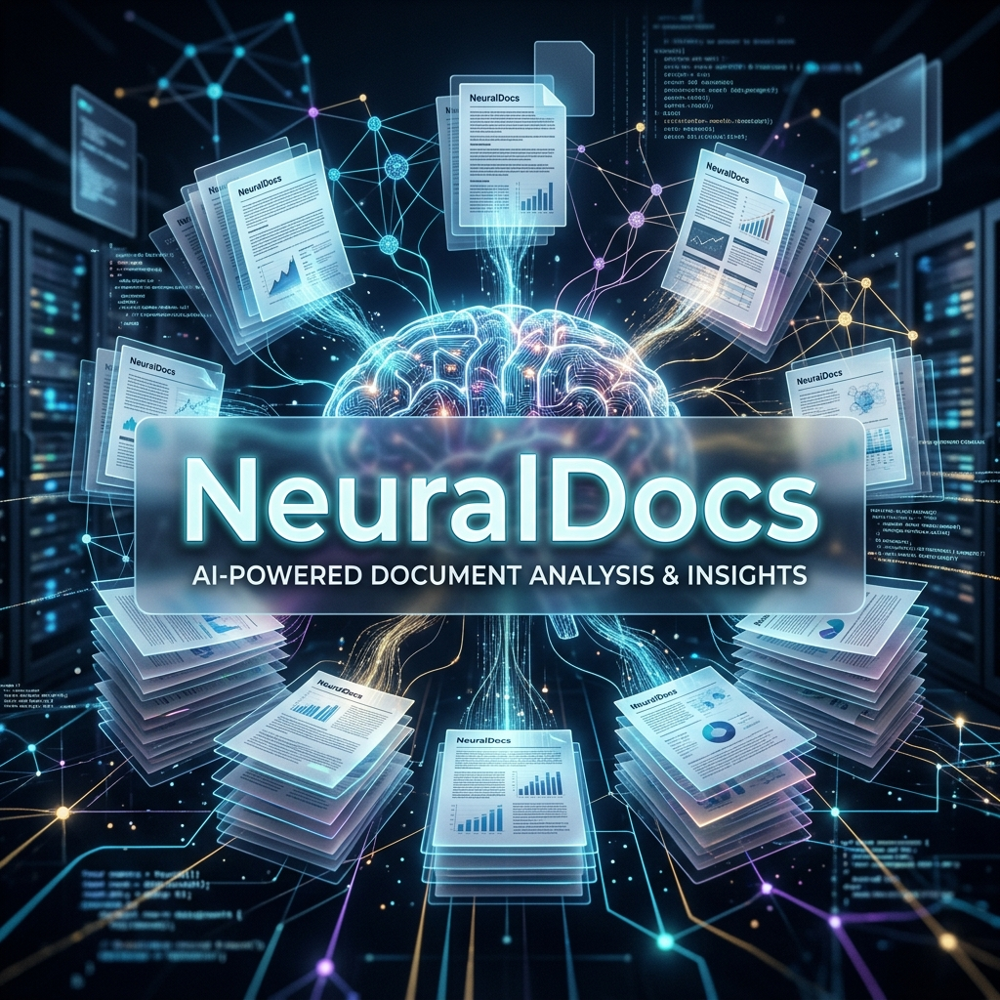
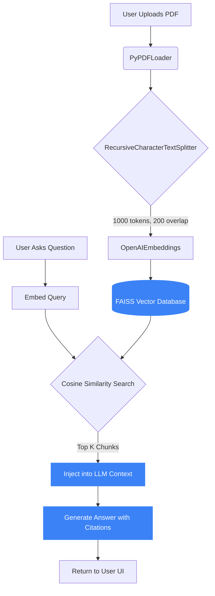

<div align="center">
  

# 🧠 NeuralDocs: AI RAG Analyst

[](https://python.org)
[](https://langchain.com)
[](https://openai.com)
[](https://flask.palletsprojects.com/)

**A full-stack Retrieval-Augmented Generation (RAG) system for interrogating complex PDF documents.**<br>
*Extracts text, builds vector embeddings via FAISS, and utilizes LLMs to provide context-aware answers.*

</div>

---

## 📖 Overview

Standard AI models are restricted to their training data. **NeuralDocs** breaks this limitation by giving the AI long-term memory and specific context through **Retrieval-Augmented Generation (RAG)**.

Users can upload complex, massive PDF documents (such as legal contracts or research papers). The system intelligently chunks the text, calculates mathematical embeddings, and stores them in a highly-optimized FAISS vector database. When a query is asked, the system retrieves the most semantically relevant chunks and feeds them to the LLM to generate highly accurate, cited answers.

---

## ✨ Key Features

- 📄 **PDF Text Extraction**: Safely parses and cleans raw text from massive PDF documents.
- 🧩 **Semantic Chunking**: Uses recursive character splitting to preserve context across long paragraphs.
- 🧮 **Vector Database (FAISS)**: Calculates dense embeddings and performs lightning-fast similarity searches.
- 💬 **Interactive Chat Interface**: A stunning, responsive UI built with pure CSS glassmorphism.
- 🛠️ **Mock Mode / Sandbox**: Can run entirely locally without an API key using the built-in Mock fallback system for demonstration purposes.

---

## 🛠️ System Architecture



---

## 🚀 Getting Started

### Prerequisites
- Python 3.8+
- An OpenAI API Key *(Optional: Only required for full LLM execution, otherwise runs in Mock Mode)*

### Installation

1. **Clone the repository**
```bash
git clone https://github.com/rahulagarwal18/NeuralDocs.git
cd NeuralDocs
```

2. **Install dependencies**
```bash
pip install flask flask-cors werkzeug langchain openai faiss-cpu pypdf2
```

3. **Set your API Key** *(Optional)*
```bash
export OPENAI_API_KEY="sk-your-key-here"
```

### Running the System
```bash
python app.py
```
> The web interface will launch locally at `http://127.0.0.1:5000`.

---

## 🤝 Contributing
Contributions, issues, and feature requests are welcome! Feel free to check the [issues page](https://github.com/rahulagarwal18/NeuralDocs/issues).

---

<div align="center">
  Engineered with ❤️ by <a href="https://rahul-agarwal.in">Rahul Agarwal</a>
</div>
